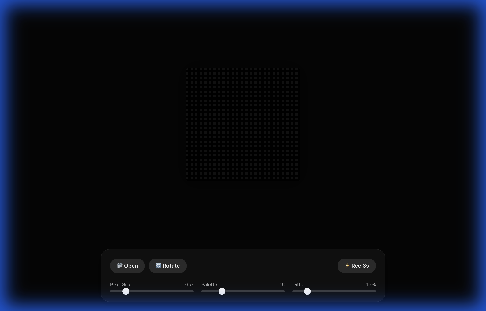

# 🎨 Mozzaic

> **Automated Pixel Art Synthesis & Aesthetic Engineering**


**Mozzaic** is a high-fidelity engine for converting images and video into aesthetically viable pixel art. It solves the "Inverse Super-Resolution" problem using GPU-accelerated dithering for real-time previews and Optical Flow analysis for temporally stable video processing.

 *(Note: Add a real screenshot here)*

## ✨ Features

- **Real-Time WebGL Preview**: Instant feedback using custom GLSL shaders (Ordered Dithering, Bayer Matrix).
- **Optical Flow Stabilization**: Backend processing uses motion vectors to prevent pixel "boiling" artifacts in videos.
- **Smart Palette Generation**: K-Means clustering in CIELAB space for perceptually accurate color reduction.
- **Client-Side Video Export**: Record and export WebM clips directly from the browser.
- **One UI Inspired Interface**: Modern, glassmorphic floating dock design.

## 🚀 Quick Start

### Frontend (Client)
The easiest way to use Mozzaic.
```bash
cd client
npm install
npm run dev
```
Open [http://localhost:5173](http://localhost:5173) to start pixelating.

### Backend (Optional)
Required only for the high-fidelity stabilized video processing API.
```bash
cd server
python3 -m venv .venv
source .venv/bin/activate
pip install -r requirements.txt
uvicorn server.main:app --reload
```
API Docs: [http://localhost:8000/docs](http://localhost:8000/docs)

## 📖 Documentation

For a deep dive into the algorithms (Optical Flow, Shaders, etc.), check out the [Detailed Technical Guide](docs/GUIDE.md).

## 🛠 Tech Stack

- **Frontend**: React, TypeScript, WebGL (GLSL 1.00), Vite.
- **Backend**: Python 3.10+, FastAPI, OpenCV, Scikit-Learn, NumPy.
- **Deployment**: Vercel (Frontend).

## 📄 License

This project is licensed under the [MIT License](LICENSE).
